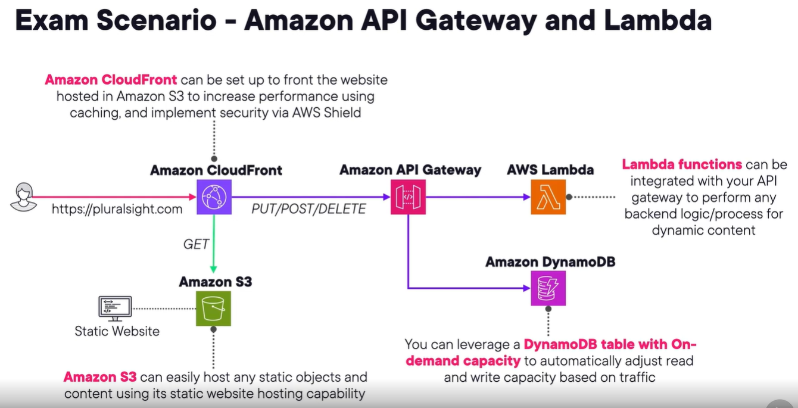
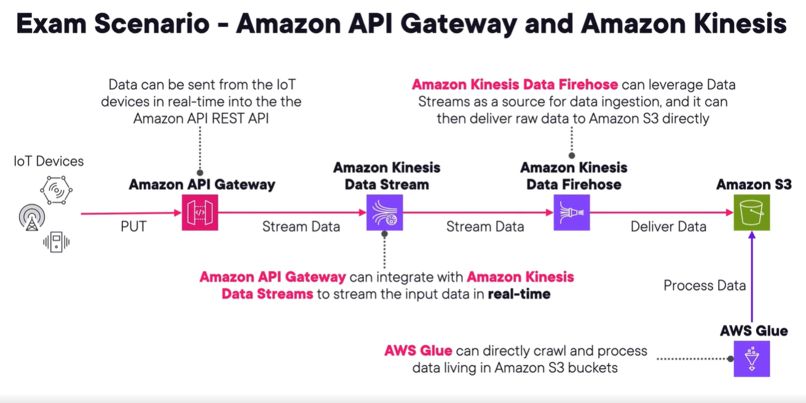
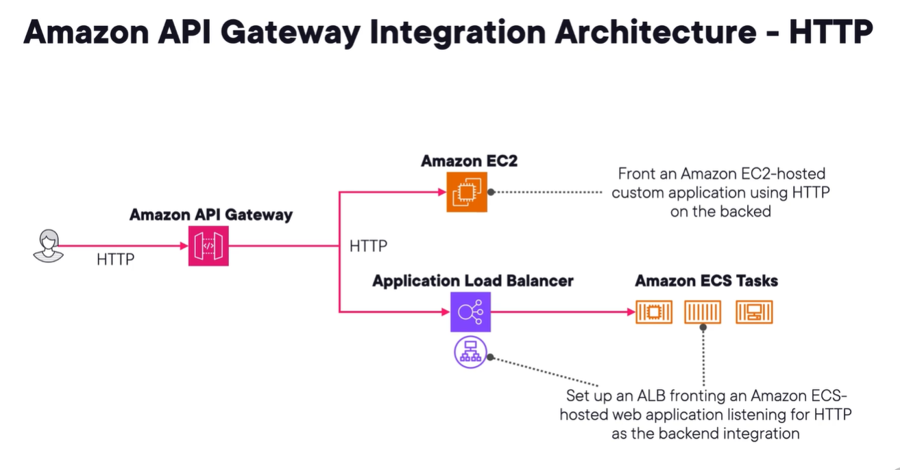
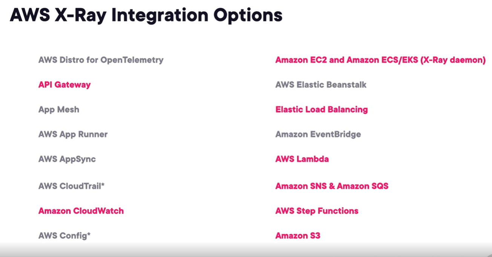

## amazon api gateway
1. managed service to easily publish, create, maintain, monitor and secure your api.
2. front door to your app.
3. integrates with lambda and others.
4. compatible with swagger and openapi.
5. allows to easily transform and validate incoming api reqs.
6. api gw endpoint types
   1. edge-optimized - default option. API reqs get sent thru cf edge location. Best for global user. GW is still deployed to a single region.
   2. regional - perfect for clients that reside in same region.
   3. private - only accessible via VPC using vpc interface endpts.
7. API types
   1. rest api - collection of http resources and methods integrated with lambda, http endpts, and other aws svcs.
   2. http api - simpler rest api. Cheaper and minimal features.
   3. WebSocket api - invoked via frontend websocket.
8. use case
   1. deploy restful api in front of amazon kinesis data streams for real-time ingestion.

## api gw authentication and security
1. resource policy to control which principal can call the api.
   1. aws acct users, source ip range, vpc, vpce.
2. authentication options
   1. publicly accessible
   2. iam roles/users
   3. amazon cognito user pools
   4. custom authorizer (aws lambda)
3. api keys and usage plans
   1. API keys - set of alphanumeric string to give customer to grant access to api.
   2. usage plans
4. You can use custom domain name to front api gw. Need tls cert from ACM for https.
5. aws WAF to prevent sql inje and xss attacks.
6. api gw allow mutual TLS support.

## api gw integrations
1. api gw can integrate with aws backend svcs.

   
2. api gw stream data to ---> kinesis data stream ---> data firehose ---> S3
   - Kinesis Data Streams is for when you want to control and manage the flow of data yourself, while Kinesis Data Firehose is for when you want the data to be automatically processed and delivered to a specific destination.

   
3. can front svcs like ec2 or ALB

   .

## api gw deployments and stages
1. create Deployment that is associated with a Stage.
2. Stage is the snapshot of api methods, responses, integrations
   - perform opti and customizations.
3. caching, customize throttles, logging, enable canary testing.

## aws AppSync
1. serverless graphql interface.
2. combines data from multiple sources like dynamodb, lambda
3. support api keys, iam, cognito, oidc.
4. js or ts for backend

## debug app using aws x-ray
1. service that collects data about reqs.
2. Can view, filter and gain insights. can help in debugging, optimization.
3. Can be used for observability and traceability.
4. Can view calls to all downstream aws resources and other microsvc/APIs or db involve in req.
5. commonly used with api gw and lambda.
6. Can integrate with the ff
   
6.