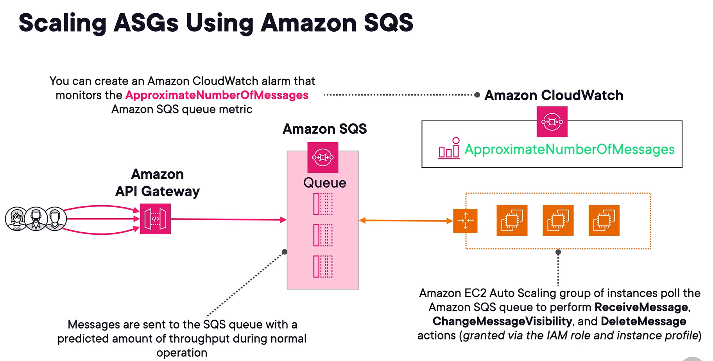
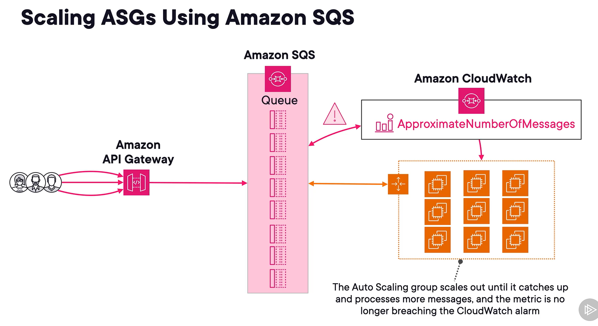
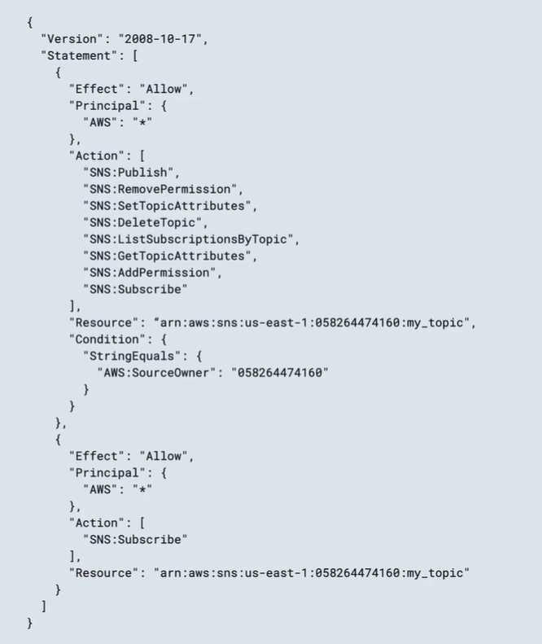
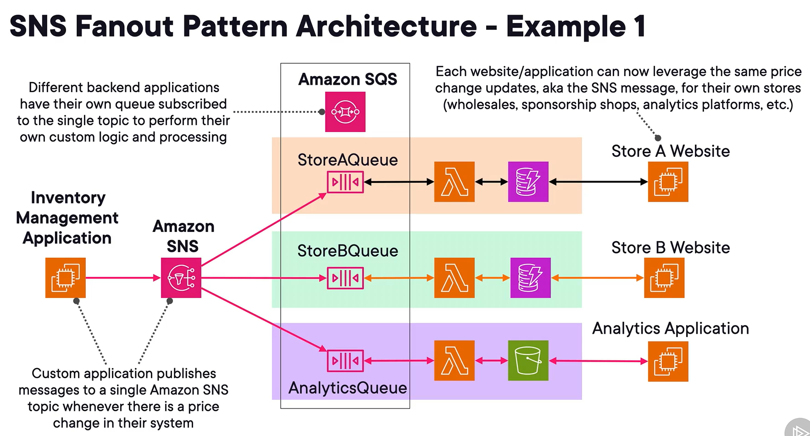
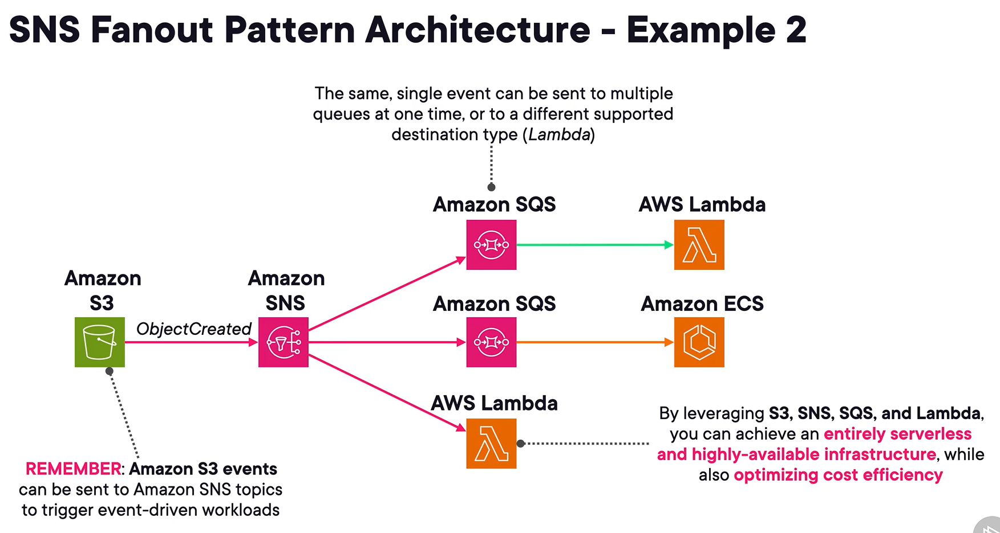

## Decoupled architectures
### Tightly coupled archi
1. components heavily depend on each other.
2. If one is impacted by downtime, entire system is impacted.
3. Leverage synchronous system design. Components directly communicate with each other. Interact same time or realtime.

### Loosely coupled archi
1. can be more complex in the design.
2. components are less dependent on each, minimizing impact of changes or failure to each other.
3. Common methodology for decoupling architecture is by use of **messaging queue**.
4. Offers resiliency and asynchronous communication

### push and pull-based messaging
1. push (topic)
   - msg sent by producer to a server and immediately sent to consumer.
2. pull (queue)
   - msgs are sent by producer to a server (queue), get queued, and pulled off by a consumer.
3. SNS for push. SQS for pull.

## amazon sqs
1. msg queue svc for async processing of work.
2. to implement decoupled and distributed systems using diff queues.
3. A resource called **producer** sends a msg to an SQS queue, and another resource called **consumer** pulls it for processing.
4. To build a buffer between components. When producers produce msg faster than consumption, msg can be queued and will be processed some time later.
5. Concepts
   1. send msg to queue via **SendMessage** api.
   2. poll and receive msg via **ReceiveMessage** api.
   3. **DeleteMessage** api after receiving and processing msg.
6. Commonly integrated with lambda func and api gw.
   - api gw is producer.
   - lambda is consumer.
7. If need durability, resiliency, availability, scalability, think SQS.
8. access control and secu
   1. use iam and access policies for controlling access to sqs queues.
   2. server side encryption to protect data in msgs. SSE-QS of kms.
   3. sqs is public svc. Important to implement correct iam policies and to restrict access via vpc endpts.
9. Best practice is to have separate queues for separate functions in a workflow.

## sqs queue
1. 2 types
   1. Standard
   2. FIFO
2. Standard
   1. default option
   2. supporting nearly unlimited # of api calls/msgs.
   3. have an at-least-once msg delivery, so need to handle duplicates or use FIFO type.
   4. not guaranteed to be delivered in order.
   5. msgs are stord in multi AZ.
   6. max msg size **256 kb**. Can be bypassed by using **amazon sqs extended client library**.
3. FIFO
   1. with more opts than standard.
   2. dont support same # of msgs as standard.
   2. use if order of operation is critical or duplicate is not tolerated.
   3. exactly-once processing.
   4. Message deduplication ID is used to prevent dupli.
   5. message group ID to maintain msg order.
4. FIFO throughput
   1. can send up to **300 msg/sec** without msg batching
   2. **3000 msg/sec** with batching.

## sqs queue attributes
1. Delivery delay/message timer
   - delay delivery of new msg for a specified # of secs. Default is 0.
2. Message retention
   - amount of time msg stays in the queue not being pulled off. Default is 4 days. Up to 14 days.
3. Short polling
   - default option where ReceiveMessage do not wait to poll queues. Common cause of empty msg and increases costs.
4. Long-polling
   - help reduce # of api calls and empty responses
   - max time is 20 secs.
5. Favor long polling over short polling.
6. Visibility Timeout
   - length time during which received msg is hidden from other consumers.
   - after this time, if the msg is not deleted, then msg will be visible again to other consumers.
   - default is 30 secs, minimum 0 secs, 12 hrs max.
   - good for long running tasks and retries.

## example architectures
1. 
2. 
3. Idea is we can create cw alarm to monitor **ApproximateNumberOfMessages** metric. When there is a spike in msg, many msgs remain waiting.
4. When alarm goes off, we can trigger auto scale action to the ASG.

## sqs dead-letter queues (DLQ)
1. Once in a while, you will experience processing failure of msgs.
2. DLQ are targets for msgs that cannot be processed successfully.
3. DLT is set as target when configuring source queues.
4. DLQ msgs can be used for further processing and investigation later on.
5. DLQ is fifo is queue is fifo.
6. can work with sqs and sns.
7. dlq is just standard fifo under the hood.
8. use cases
   1. useful for debugging apps and mssging systems by analyzing msg contents.
   2. to see if you have given consumers enough time to process msg. Related to visi timeout.
   3. Redrive - to send back to source queue or different queue to process.

## Amazon SNS
1. push-based. Producer push msg to a server and immediately sent to the consumers.
2. push-based mssging svc.
3. Proactively delivers msgs to the endpoints subscribed to it.
4. useful for alerting systems or persons, and triggering event-driven workloads.
5. can be **one-to-one** and **one-to-many**.
6. producers send msg to a **topic**. Topic pushes msg to consumers.
7. Consumers subscribe to an amazon sns topic to receive msgs.
   - by default, all incoming msgs are sent to all confirmed subscriptions.
8. Messages are encrypted in transit by default. You can add at test encryption via aws kms.
9. Subscriber protocols
   1. data firehose, email/email-json, sqs, lambda func, http/s endpts, SMS, platform app endpts.
10. up to 256 kb size of msg.
   - use amazon sns extended library to extend up to 2 gb.

### securing sns
1. aws iam
2. access policies.
3. cross account msg publishing, specifying specific principals that can subscribe.
4. 

## sns topic
1. 2 topic types
   1. standard
   2. fifo
2. standard topic
   - default option
   - good enough for most infra and reqs
   - 100k topics/acct
   - 12,500,000 subsriptions/topic
   - no msg archiving or replay
   - highest throughput
   - at least once delivery with best-effort ordering
3. fifo
   - best for special reqs.
   - 1000 topics/acct
   - 100 subsriptions/topic
   - offers msg archiving an replay
   - 300 msg/sec
   - strict msg ordering and exactly-once delivery.
   - **fifo topics can only send msg to sqs fifo queues**.
4. SNS topics support cross-region and cross-acct.
5. DLQ for failed delivery.
6. Filter policies to define which msg a subscriber gets.

## fanning out with sns and sqs
### sns fanout
1. multiple subscribers on the same topic so that msgs are sent to multiple endpts at the same time.
2. allows for fully decoupled, parallel, async processing.
   - allows to process same msg differently based on endpts subscribed, like online ordering system.
3. process msg independently.
3. sns fanout pattern archi.
   1. 
   2. 
4. S3 events can be sent to sns topic.E