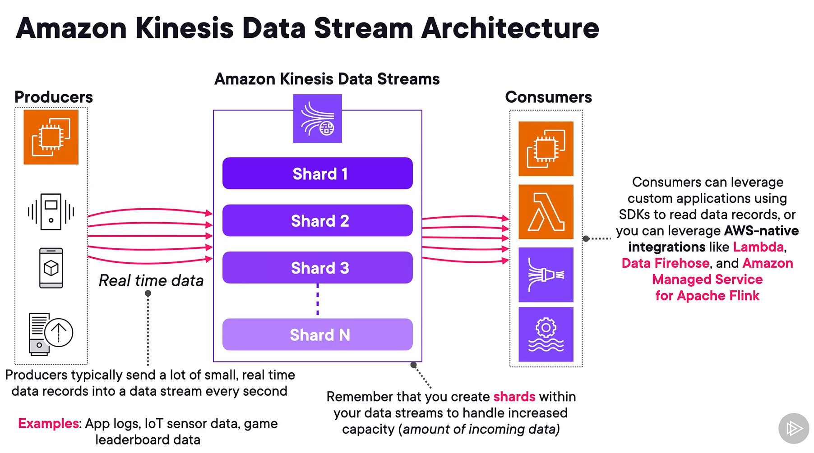
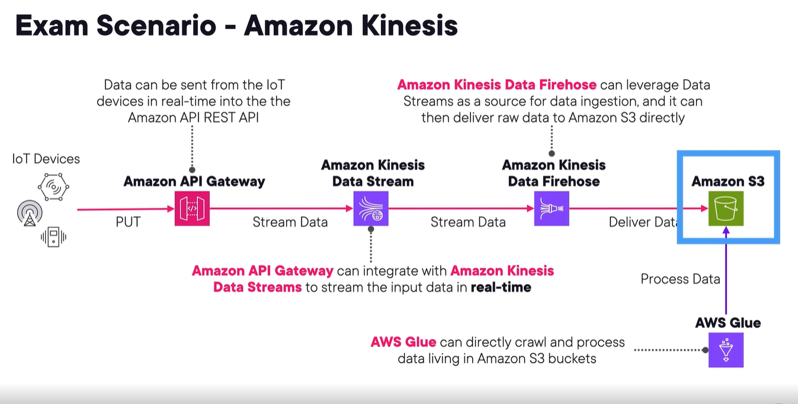
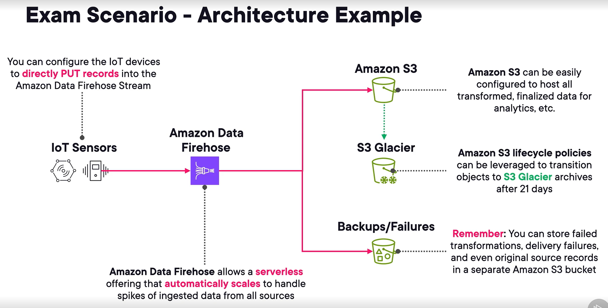
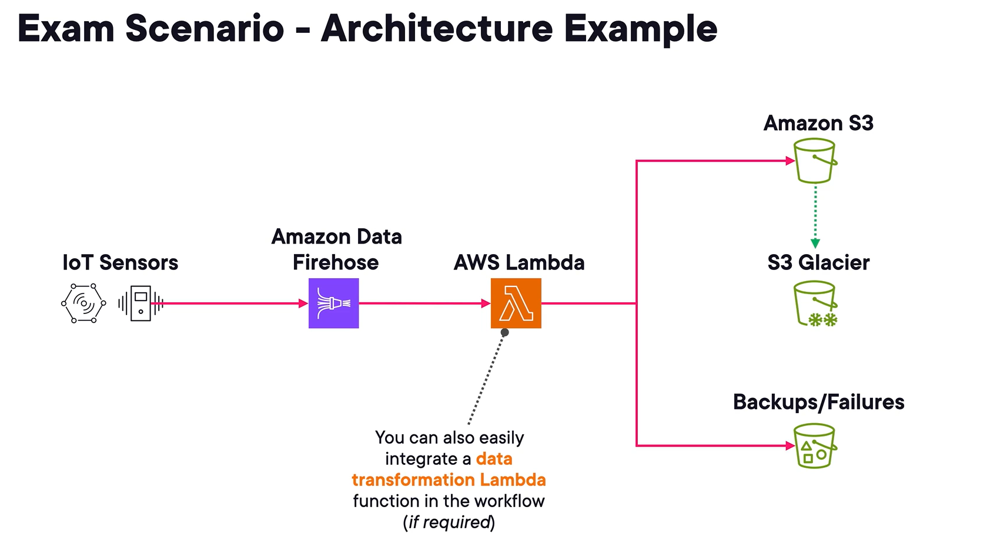

## amazon kinesis
1. allows you to ingest, process, analyze real-time streaming data and video.
2. like a huge data highway connected to your aws acct.
3. polling-based/pull-based
4. 4 important versions
   1. kinesis data streams
   2. data fire hose
   3. kinesis data analytics for sql applications
   4. kinesis video streams
5. For realtime or near realtime streaming.

## amazon kinesis data streams (kds)
1. **realtime streaming** of incoming data.
2. apps called consumers read data records from the streams.
3. perfect for large amounts of fast data ingestion.
4. typically takes <1 sec for data to be pulled off a stream.

### Concepts
1. Producers are the one pushing data to kinesis data streams.
2. Consumers (apps) processes the stream data in realtime.
3. Kinesis data streams contain shards, which what hold your data. Contains sequenced **data records**.
4. Data records are unit of data. 1 mb in size.
5. **Retention period** - configurable amount of time data records are available after being added to the stream. default 24 hrs, max 365 days.
6. **Shard** - streams are made up of 1 or more shards that have set amount of capacity. 5 read/sec or 2mb/sec reading. Writing 1000 writes/sec or 1mb/sec.
   - you create shards.
7. Ordering - partition keys are required when adding data to stream.
8. Replay - msgs do not go away until they expire, even when they get consumed. Allows for multiple consumers to replay same data records in same order.
9.  supports encryption within data streams using aws kms keys.
10. 

### producing and consuming data
1. Producers will use amazon kinesis producer library (KPL).
   - meant to make ingesting data simpler
   - handles aggregation, metric collection, retries.
   - not same as kinesis data streams api.
   - perfect for ec2 writing thousands of events/sec.
2. Consumers will use kinesis client library (KCL).
   - standalone java lib.
   - simplify consuming and proce data from kds.
   - offers load balancing across multiple workers, handles failures, responds to changes in # of shards, etc.
3. aws sdk for java is less popular option.
4. Enhanced Fan-out
   - makes kds push-based.
   - allows data to immediately get pushed to all consumers once it is ready on the data stream.
   - high performance.
   - incur addtl cost.
   - **to scale consumers of kds.**

### capacity modes
1. data stream capacity is the config to set how much data a stream managers and and can handle.
2. charged based on capacity
3. options
   1. on-demand
      - dont worry about planning. Auto scales and manages your shards.
      - for highly variable and unpredictable traffic.
   2. provisioned
      - set # of shards you want.
      - manually incr or decr # of shards.

## amazon data firehose (dfh)
1. **near realtime**, managed, serverless data streaming solution.
2. producers send data to a stream and it auto sends it to a configured destination. **Only 1 destination is allowed**, unlike kds..
3. commonly used to send ingested data to
   1. s3
   2. redshift table
   3. amazon opensearch service and serverless
   4. supported 3rd party providers like datadog, elastic, etc.
4. Amazon Kinesis agent - java app that sends data to fh stream.
5. allows for data transformation mid-flight via lambda.
6. only pay for what you use.

### firehose streams
1. what makes svc run.
2. where data lives, for sending data to.
3. 3 sources for fh streams
   1. Direct PUT - producer apps write directly to the stream using PUT cmds. Svcs include aws sdk, cw, sns, aws iot, kinesis agent.
   2. amazon kds - .
   3. amazon managed streaming for apache kafka (msk) - reads directly from kafka cluster.
4. sample dfh s3 scenario - 
5. sample dfh lambda scenario - 

### records and buffers
1. records <= 1000 kb
2. incoming data is buffered before being sent to desti.
   1. buffer size
   2. buffer interval
   3. data is sent when either of above is triggered.
3. can send several formats like json, parquet, text, binary data.
   1. leverage converting parquet and orc formats.
   2. compressing delivered records via gzip and snappy.
4.