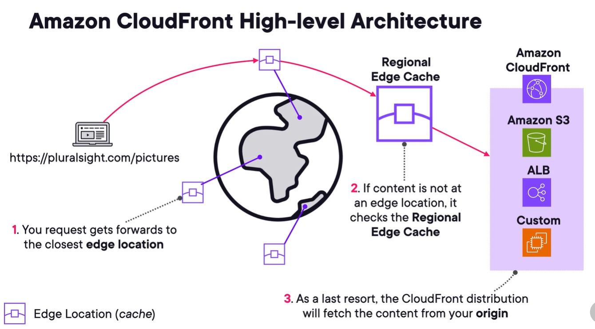
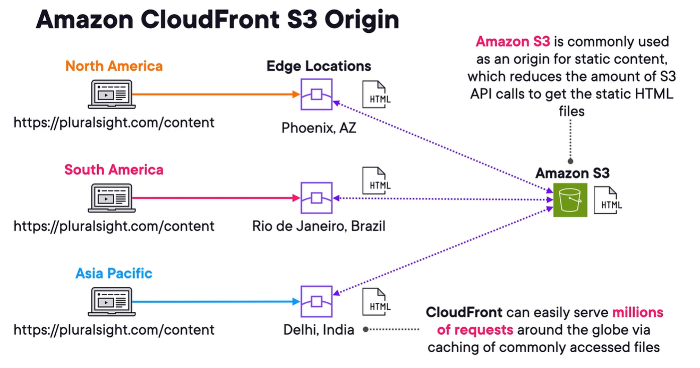
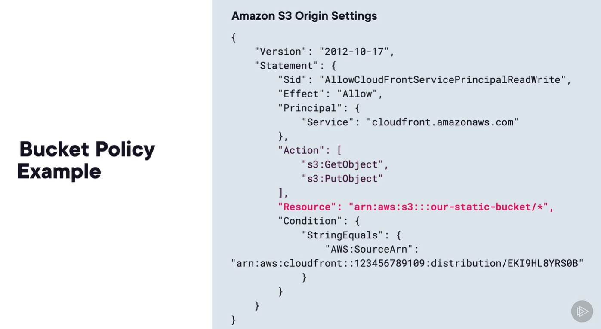

## amazon cloudfront (cf)
1. cdn service that securely delivers data, vid, app, and apis to customers globally.
2. reduces latency and provides higher transfeer speeds using aws edge locations.
3. you set up **origins** that host your content.

### cf origins
1. Origin - location of any stored content that you want your distributions to cache for end users.
   - S3 or custom origin.
2. Distributions - configuration telling cf which origin server to use, and how to manage delivery.
3. Can easily use cf to front s3.
4. Custom origin - supports ALB, ec2 instances, any http server (onprem, VMs, etc)
5. **exam pro tip:** amazon cloudfront is only for http/https conns. (layer 7 traffic)
6. ---
   1. requests forwarded to closest edge location based on dns resolution.
   2. 
   3. 
7. **TTL** - set min, max, default ttl.
8. **Invalidation** - manually invalidates files to remove them in cache and force a fetch to the origin.
9. Versioning

### cf security
1. 2 ways to controll access to s3 origins
   1. Origin access identity (OAI)
   2. origin access control  - most recommended bec of adv features.
   3. these 2 are method of sending authenticated reqs to aws origin, but this is not a iam role or a user
2. you use s3 bucket policy to grant access to cf.
3. 
4. **AWS WAF** - create waf web ACLs and associate to cf distributions.
5. **aws shield** - mitigate and prevent ddos agains distributions.
6. **Georestriction/geoblocking** - prevent users from some geographic locations.
   - allow list or block list.
   - country based restrictions

### cloudfront custom domain name and TLS
1. when you create a distribution, you are given an aws-provided URL.
2. **Viewer protocol policy** - protocol policy that tells whether to use http/https to access content.
3. you can require **https**.
4. custom dns tls with ACM.

### cloudfront functions and Lambda@Edge functions
1. Four portions of request and response
   1. viewer request
   2. viewer response
   3. origin request
   4. origin response
2. Custom processing at the edge via edge functions
   1. cf functions
      - managed within cf svc
      - support javascript only
      - perfect for high-scale latency-sensitive cdn custom reqs
      - only work at viewer request and response
   2. lambda@edge functions
      - managed with lambda svc
      - support nodejs, python
      - must be deployed to us-east-1
      - work at all 4, viewer and origin request and response.
      - supports thousands of req/sec can run up to 10 secs
   3. use cases
      - basic authn and authz closer to users
      - customize content based on uesr loc, device, preferences
      - serve diff versions of website to test user engagement
      - optimize content delivery by compressing files
      - add security headers or enforce https