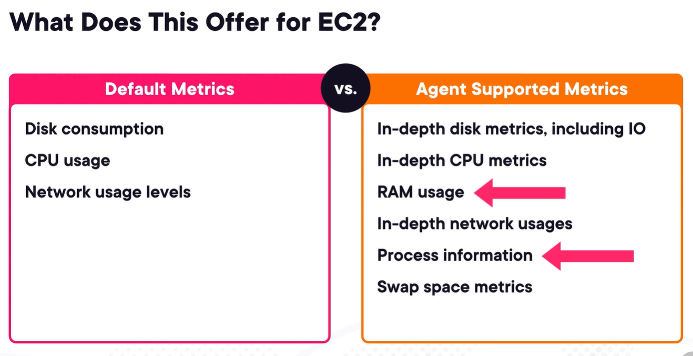

# amazon cloudwatch logs
1. allows to monitor, store, access log files from diff sources.
2. can query logs for investigation.
3. logs are encrypted by default. Can use kms.
4. some cw logs desti
   1. s3
   2. kds
   3. dfh
   4. lambda
   5. opensearch
5. 3 important terms
   1. **Log Event** - event in the record of actually happened within the app or aws svc.
      - contains timestamp and raw event msg, including custom logging event.
   2. **Log Stream** - collection of sequence of logs from same source. Think of as a continuous set of logs from a svc.
   3. **Log Group** - collection of log streams with same retention, monitoring, access control settings.
6. Log Retention
   - for log groups
   - expire after 1 day, 7 days or never expire.
7. some Log sources
   1. SDKs
   2. cw agent
   3. cw unified agent
   4. lambda funcs
   5. vpc flow logs
   6. aws api gw
   7. cloudtrail trails
   8. route 53 dns query logs
   9. elastic beanstalk
   10. ecs conts
   11. etc
8. there might be times you want logs to be sent to other destis. Use **amazon cw logs subscription**.
   - gives you realtime feed of log events from cw logs.
   - supports kds, lambda funcs, dfh, amazon opensearch svc
   - **filter patterns** filter which logs to deliver.
   - Log subscription filters can be set at acct level, or log grp level.
9. can export logs to s3.
   - for custom processing
   - bucket can be in the same acct or diff acct
   - export logs can take up to 12 hrs, not realtime.
10. **Log Groups are regional resources**.

### custom logging with cw logs agent
1. apps in ec2 do not log by default to cw logs.
2. But this can change by installing and using cw logs agent.
   1. collect ec2/onprem system-level metrics.
   2. retrieve custom metrics from **statd** or **collectd**.
   3. collect logs from ec2/onprem
3. need proper IAM permissions so agent can push to cw logs.
4. **CW logs unified agent (cwlua)** is the updated version of cw agent.
   - supports more colection options (metrics, log locations, etc), more destis now just cw.
5. Default metrics
   1. disk consump
   2. cpu usage
6. Agent supported metrics
7. 
8. exam scenario
   1. you can use Systerms Manager automation to install cwlua.
   2. you can automate export logs to s3 using lambda.

### cw metrics
1. cw does both logging and observability using metrics.
2. **Metrics** are regional.
   - time-ordered sets of data pts published to cw.
    - most aws svcs provide free metrics, like cpu usage in ec2.
    - by default, they come in at 5 min interval.
    - you can enable **detailed monitoring** for faster interval.
    - can publish own metrics using agent.
    - can create and share dashboards.
3. CW metrics concept
   1. **Namespace** - containers meant to grp and isolate common metrics.
   2. **Timestamp** - associated to each metric data pt.
   3. **Dimensions** - name/value pair to identify the metric.
4. **Detailed monitoring** - only works for certain aws resources. Incurs addtl cost.
   - for ec2, can gather metrics in 1 min interval.
5. Metric Streams
   - to continually stream cw metrics to destis.
   - near realtime deliv with low latency.
   - commonly streamed to s3
   - supports some 3rd party svcs.