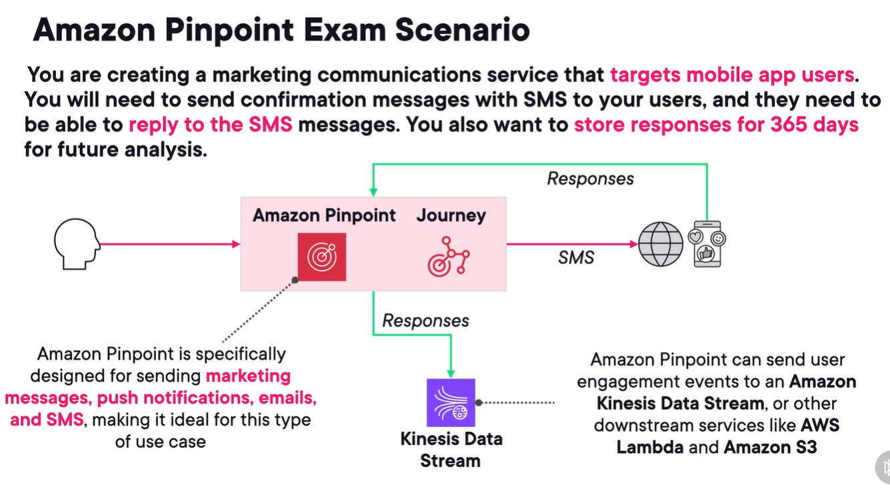

## amazon pinpoint
1. enables you to engage with customers through messaging channels.
2. Create **journeys** to customize engagements.
3. intended for
   1. marketing teams
   2. business users
4. **exam indicators:** marketing campaigns, user engagements, sending emails to targeted audiences.
5. sample archi - 

## aws amplify
1. offers tools and libraries for frontend web and mobile devsto build full stack apps.
2. offers
   1. frontend libs
   2. ui comps
   3. backend building
   4. easy authn and authz
3. like firebase
4. offers simplified development for less experienced teams.
5. supports ssr frameworks: next, nuxt, astro, etc
6. supports spa frameworks: vue, react, angular etc
7. supports ssg: gatsby, hugo, eleventsy, jekyll, vuepress, etc
8. **consider for anything managed SSR, easy mobile dev, running full stack app.**