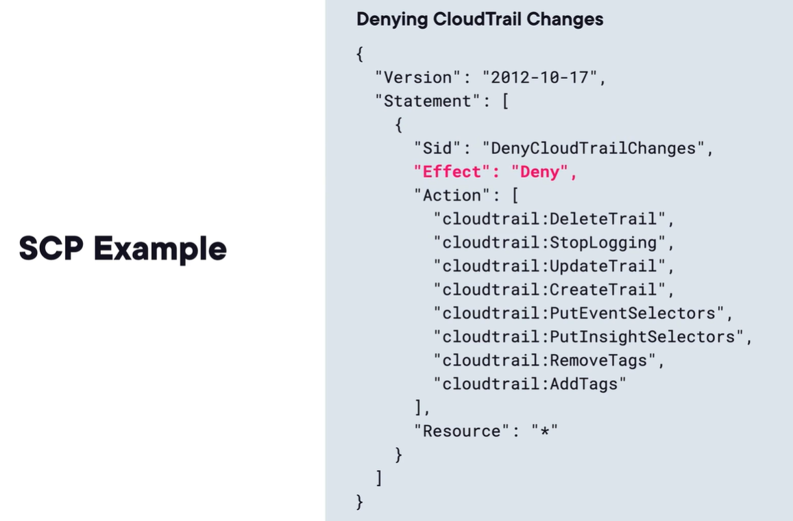

## multi-account archi
1. critical design strategy based on well-architected framework
2. example acct structure
   1. acct per environment
   2. acct per department (hr, billing, security)
3. benefits
   1. stricter controls for security and compliance.
   2. isolate workloads and reduce blast radius reduction.
   3. billing separation
4. how to manage multiple accts at scale? **AWS Organizations**!

# aws Organizations
1. free governance tool to create and manage multiple aws accts in single loc.
2. When you create an organization, you get one main acct called **management account**, aka **payer account**.
   - other accts that are created/join the org are called **member accts**.
   - member accts only belong to single org.
   - logically group member accts using **Organizational Unit (OU)**
3. aws organizations high level archi
   - Root OU - default ou, always available.
   - 
4. **exam pro tip**: **aws iam identity center** (SSO) commonly integrates with aws organizations.
5. **aws:PrincipalOrgID** condition
   - global condition key
   - becomes available once you create aws org.
   - can use this key in Service Control Policies, iam identity policies, resource policies

## important aws organizations features
1. 2 feature sets
   1. All features
   2. Consolidated billing
### consolidated billing
1. free feature allowing all member acct bills to merge to a single payer acct. So, one payment method only.
2. that is why management acct is also called payer acct.
3. allows for discount sharing.
4. usage discounts for aggregate/volume use of member discounts.
### All features
1. StackSets - aws org allows to easily deploy cf stacks across accounts and regions.
2. Delegated admins
   - you can delegate policy/service management to member accts.
3. OrganizationAccountAccessRole
   - iam role created in each acct
   - to be assumed when needed
4. cost allocations tags
5. service control policies (SCPs) - policies to restrict/allow acct actions

## best practices for aws Organizations
1. multi acct strategy prevents you from running into acct svc limits.
   - create new acct and reset quota
2. you can enable organiztaional cloudtrail trail for centralized logging.
3. implement logging/security acct for hosting centralized cw logs in s3.

# Service Control policies (SCP)
1. json policies applied to accts and OUs to restrict actions for user and roles.
2. do not grant permissions, just dictate permissions that can be granted via aws iam.
3. **default behavior is deny all actions**, like aws iam.
4. default policy is FullAWSAccess policy.
5. two important concepts
   1. SCPs do not impact management acct.
   2. impact root user within member accts
   3. **exam pro tip:** if you need to restrict root user actions in member accts, think SCPs.
   4. 

# aws control tower
1. svc that provides simplified quick way to set up and govern aws multi-acct env based on best practices.
2. uses and extends aws org
   1. automate acct creation
   2. implement secu control
   3. prevent governance drift
## concepts
1. Landing zone
   - well-architected multi-acct env for all your aws resources
2. shared accts
3. Controls (guardrails)
   - applied mandatory preventive controls and detective controls
4. 2 types of control
   1. **Preventative** - implemented using SCPs
   2. **Detective** - implemented using AWS config rules.
      - can use this detective controls to trigger remediation.
5. Preventative prevents, Detective detects.
6. aws control tower account factory - repeatable deployment of new accts.

# aws resource access manager
1. free svc that allows ot share resources with other accts without creating duplicates.
2. member accts in org or external accts.
3. commonly shared resources
   1. transit gw
   2. vpc subnets and sec grps
   3. aws network firewall policies and rules
   4. route 53 resolver rules
   5. vpc customer managed prefix lists
4. Member accts of external acct will be able to access resources.