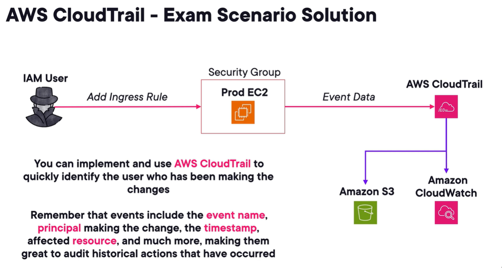

# aws cloud trail
1. svc that increases visibility and governance of aws resources by recording user and resource activity.
2. records aws management console actions and api calls.
3. enabled by default, cannot be turned off.
4. allows for
   1. incident investigation
   2. near real time detection of api calls
   3. helps maintain regulatory compliances
5. what does it record?
   1. aws mngmt console actions, even login
   2. aws cli calls
   3. aws service actions
   4. aws sdk api calls
6. CloudTrail event
   - record of an activity in an aws acct, providing historical trails
7. ct event types
   1. **management events** - info about mngmt operations. For example, TerminateInstance ec2 api call.
   2. **data events** - info about operations on resource. Tends to be high volume. Example is s3 GetObject
   3. **Insights events** - capture unusual api call/errors rates in your aws accts
8. Event retention
   - up to 90 days before removal
   - can be customized using cw and s3

# cloudtrail trails
1. Trails
   - config or resource you want to record events of.
2. regional resources. Captures events in respective region.
3. supports multi region deployment.
4. customize delivery of logs for long term storage in cw and s3.
5. trigger rules on events using EventBridge.
6. encryption using kms.
7. can set up SNS notif for log file updates, for example in s3.
8. **Organizational trail**
   - configure delivery of ct events in the mngmt acct and member accts in an org to same s3, cw logs, and eventbridge.
9. Log file valida tion
   - feature to help determine whether log file was modified, delete or unchanged after ct delivered it to the destination.
10. get one free trail per region.
11. exam scenario
    - 

# aws Config
1. inventogy mnagement and control tool that allows you to view the config history of your infra over time.
2. offer the ability to create rules to make sure resources conform to your reqs.
3. configured per region.
4. can receive alerts via sns when changes in compliance occur.
5. works with aws organization.
6. can store config data in s3.
7. aws Config Status
   1. COMPLIANT
   2. NON_COMPLIANT
8. **AWS Config is a reactive svc, not proactive.** Does not prevent changes.
9. commonuse cases
   1. **restricted-ssh** - make sure incoming ssh traffic for sec grps is accessible to a restricted CIDR, not open to the internet.
   2. **ec2-ebs-encryption-by-default** - check ebs encryption is on
   3. **s3-bucket-server-side-encryption-enabled** - check s3 bucket has default encryption enabled or denies PutObject calls without encryption.
   4. **cloudtrail-security-trail-enabled**
10. can use aws Config to evaluate tagging compliance for resources.

## aws config rule and remediation
1. compliance check helping you manage your ideal config settings which then evaluates compliance status.
2. two offerings
   1. aws managed rules
   2. custom rules
3. rules can be triggered based on config changes, or scheduled.
4. custom rules can leverage lambda or Guard to perform evaluation.
5. can perform remediations with retries
6. remediations are done via **aws systems manager automation documents**
7. Aws config is never free.
8. aws config rule notif destination
   1. eventbridge to trigger workloads
   2. send updated config details to s3
   3. sns

# aws truster advisor
1. fully managede best-practice auditing tool for aws accts.
2. account level.
3. requires no agent installed.
4. uses industry and customer-established best practices.
5. inspects aws environments and makes recomm
   1. save money
   2. system availability
   3. system performance
   4. close potential secu gaps.
6. Check Categories
   1. cost optimi - make recomm on where you can save money
   2. performace - how to improve speed? Scale?
   3. security
   4. fault tolerance
   5. service limits - usage of entire acct
   6. operational excellence - operate much more effectively and at scale. Using asg, global accelerator, etc.

# amazon inspector
1. automated security assessment svc.
2. helps improve security and compliance of apps deployed to aws.
3. like sonarqube? sast dast?
4. after performing an assessment, amazon Inspector produces security findings with levels of severity.
5. findings can be sent to EventBridge.
6. Scan types
   1. agent-based - use ssm agent to continuously scan instances.
   2. agentless - scans ebs snapshot to collect software inventory.
7. amazon ec2
   - use ssm agent.
   - collect software inventory and look for package vulnerabilities.
   - will look for potential network reachability vulnerability
8. ecr images
9. aws lambda
   - can scan lambda
10. **exam pro tip:** think amazon inspector if you need regular security scans on ec2 or lambda funcs.

# Amazon GuardDuty
1. managed threat detection svc or IDS.
2. Uses ML to detect malicious behavior.
3. not intrusion prevention svc, but ids.
4. example
   1. detect unusual api calls from malicious IP
   2. compromised instance
   3. port scanning
   4. unauthorized cryptomining activity
5. does not require installation of any software or agent.
6. offers free trial for 30 days. Can be expensive.
7. alerts appear in GuardDuty console and EventBridge.
8. updates its db of known malicious domains using external feeds.
9. foundational data sources
   1. cloudtrail logs
   2. vpc flow logs
   3. route53 resolver dns query logs
10. extended sources
   1. rds/aurora
   2. s3
   3. lambda and eks
11. **exam pro tip:** it is common to set up a delegated admin acct for amazon guardduty for centralized reporting.

# amazon macie
1. managed data security and privacy svc to identify PII and sensitive data in S3.
2. uses ML.
3. can alert you via sns and trigger worloads.
4. works with eventbridge.
5. great for trying to meet compliane frameworks like hipaa, pci, gdpr.