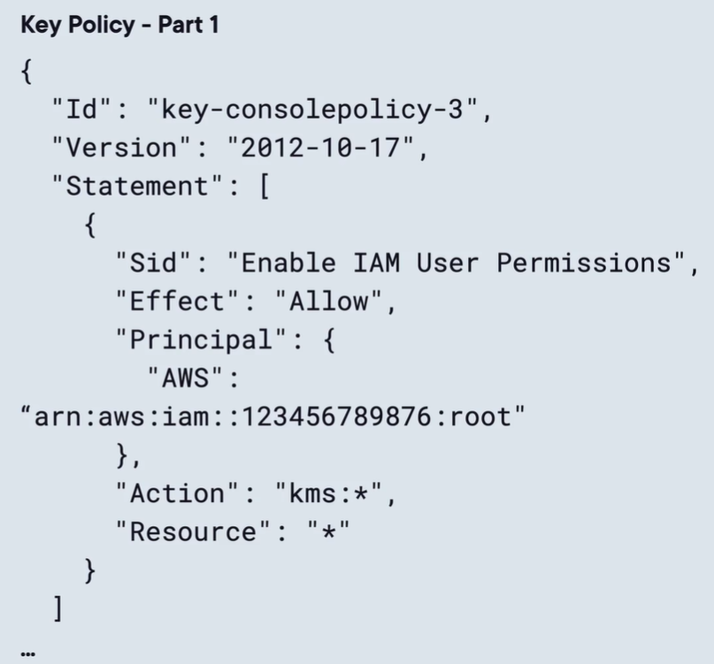

# aws certificate manager (acm)
1. svc to create, manage and deploy public and private tls cert.
2. offers private CA option.
3. commonly integrates with
   1. ELB
   2. cf distributions
   3. amazon api gw - regional and edge-optimzed gw
4. cannot directly associate with ec2 instances.

### public tls certs
1. request and use public tls cert for free.
2. still pay for resources using them.
3. auto renewal of acm-issued tls cert. Auto renew 60 day s before expiration if still valid.

### types of domain to know
1. FQDN - complete address of a host on the internet to specify exact location. Example, **www.pluralsight.com**.
2. wildcard domain - to match all possible subdomains with one cert. Like **blog.pluralsight.com** and **app.pluralsight.com**.

### methods of validating domain ownership
1. dns validation
   - recomm method and requred for auto renewal to work
   - create CNAME
2. email validation
   - not recomm

### importing tls certs
1. can import cert from godaddy, digicert, etc.
2. no auto renewal.
3. To renew, need to get new cert and import again.

### regional and global cert req
1. regional resources require acm certs in the same region.
2. global resources need acm in us-east-1.
   - edge-optimized gw and cf need an acm cert in us-east-1.

# aws key management service (kms)
1. managed svc to create and control encryption keys to encrypt data.
2. protected by fips 140-3 security level 3 hardware security modules.
3. integrates with many aws svcs.
4. track kms key usage with ct trails.
5. control access via iam and key policies.
6. leverage vpc endpts for secure access.

## aws kms keys
1. regional key to be used in your own apps.
2. Key material origin
   - source of the key material in your kms key.
   - cannot be chaned once chosen.
3. origin
   1. aws kms - aws creates the key for you. Easiest.
   2. custom key store- key material is generated and used in aws cloudhsm cluster.
   3. imported - import key material from own key mgmt infra
4. kms keys never leave the aws kms service.

### 3 high level key types
1. customer managed
   - you create, own and manage. You have full control.
   - you create and maintain key policies and iam policies.
   - can enable and disable key.
   - can enable auto rotation of key material. Or manually rotate.
   - schedule deletion of keys with 7-30 day waiting period.
   - never free. Pa per use and a monthly fee per key
2. aws owned
   - kms key that aws svc owns and manages for use in multiple aws accts.
   - perfect if you do not need to audit or control the key
   - free of charge. Rotation and deletiongs are managed.
3. aws managed
   - legacy, replaced by the similar aws owned.
   - can view the keys in your acct.
   - cannot change key properties.

## aws kms key policies
1. resource policy for controlling access to kms keys.
2. json
3. primary method for access.
4. each kms key must have one policy.
5. work with iam policies and key grants.
6. for any principal, explicit permission is required to access kms keys.
7. any deny permission in evaluation chain will result in denial of use.
8. **Key poli cies must explicitly allow access to keys. IAM alone is not enough.**

### controlling permissions
1. key policy
   - can give full scope of access to the key in a single document
2. combination
   - iam policies with key policy.
   - manage all permissions for your iam identities in iam.
3. grants
   - key policies for primary permissions, then grants temporarily allow permissions be delegated from authzed principals.
   - commonly used by aws svcs.
4. 

## aws kms multi-region keys
1. kms keys are regional resources.
2. multi-region key uses same key material and key id.
3. acts like you have same key everywhere.
4. seamless encryption and decryption across aws regions.
5. still regional, not global resource.

# aws CloudHSM
1. hardware security module is a computing device that processes cryptographic operations and provide secure storage for cryptographic keys.
2. when kms encryption is not enough
3. cloudhsm is aws-based hsm to generate your own encryption keys on aws cloud.
4. physical dvc dedicated to you.
5. low latency access and secure hsm management.
6. exam indicators
   1. need full ctrl of underlying cryptographic hardware
   2. need full ctrl of users, grps, keys
   3. aws kms is not enough.
7. perfect for strictest req.