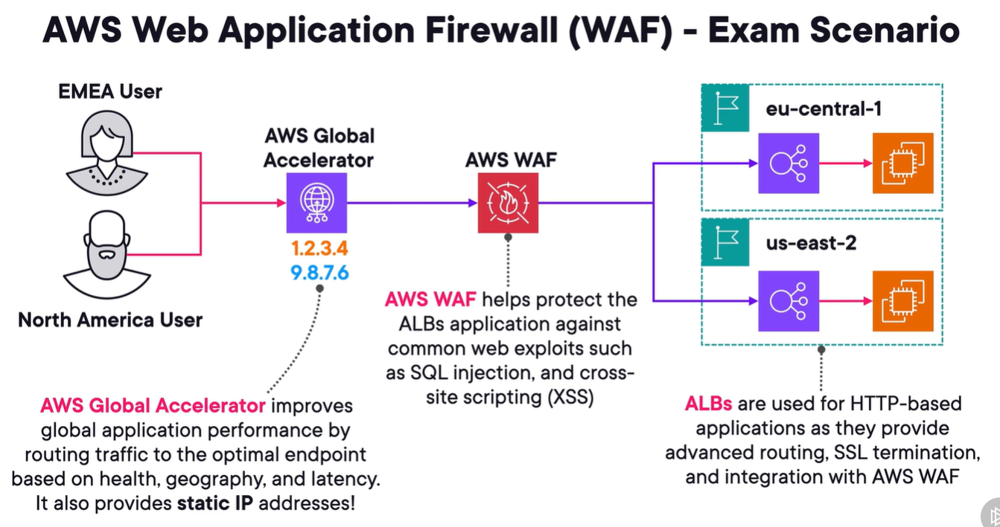

# aws shield and shield advanced
1. aws shield can help block and absorb ddos attacks.

## Shield standard
1. is free ddos detection and mitigation svc at the perimeter of app networks.
   - work against common network and transport layer ddos attacks
   - SYN/UDP, reflection attacks, other layer 3 and 4 attacks.
2. commonly used with
   1. route54
   2. cf
   3. global accelerator

## shield advanced
1. enhanced protections with always-on monitoring for apps, including layer 7 traffic.
2. supported resources
   1. shield standard resources
   2. elb
   3. ec2
   4. resources with elastic ip addr
3. gives access to 24/7 access to **aws shield response team**.
4. not free

# aws web application firewall (waf)
1. waf that monitors http and https req that are forwarded to supported resources.
2. for layer 7 (app layer) traffic.
3. supported resources protected by waf:
   1. alb
   2. api gw
   3. cf
   4. appsync
   5. cognito user pools
4. You define Web ACLs to define req criteria.
5. create web acl rules.
6. web acls are regional rsrces.
7. rule group ror reuse.
8. Rule actions
   1. allow - allow req to be forwarded
   2. block
   3. count - not allow or block, only count the req
   4. captcha - use captcha and silent challenges

## rule statements
1. what matches the traffic so rule actions can trigger
   1. IP set - does this match ip or within range we set.
   2. geographic - geomatches
   3. regex
   4. sql injection - look for injection code in req
   5. string match - look for custom string in req
   6. cross site scripting
2. **exam tip:** can use **rate-based rule** to limit # of reqs when they come at too fast a rate.
3. 