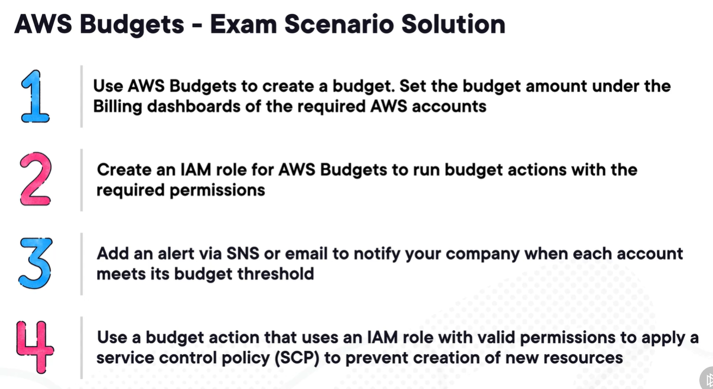
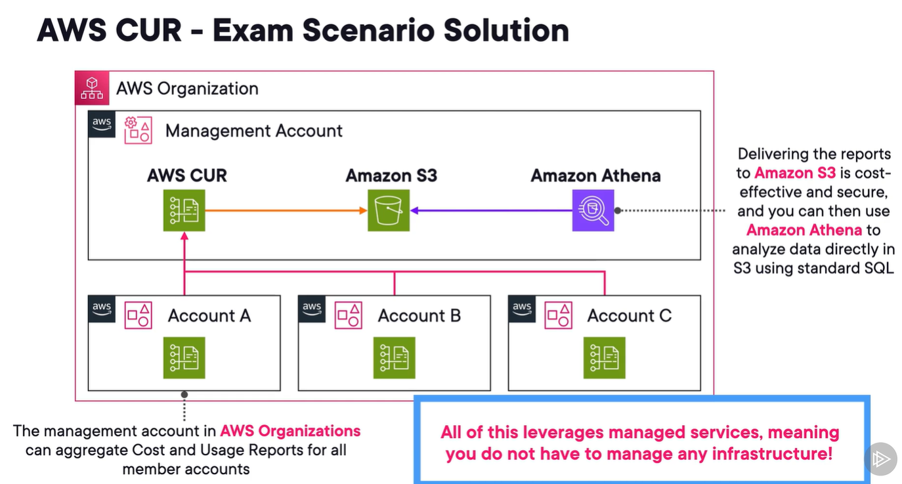

# aws cost explorer
1. allows to visualize, analyze, manage cloud costs.
2. can generate custom reports by
   1. resource tags
   2. resource
   3. svc categories
   4. hrly, daily, monthly times
3. built in forecasting up to 12 months.
4. recommends saving plans.
5. tags are one of the most important ways to track spend.
6. 2 cost allocation tags
   1. aws-generated. **aws** prefix
   2. user-defined
   3. both must be activated separately

# aws budgets
1. svc to plan and set expectations on cloud costs.
2. commonly used with aws org.
3. track ongoing spend and create alerts when a limit is about to be reached or reached.
4. use with aws cost explorer for more fine-grained budget.
5. **tagging resources is important.**
6. Budget actions
   - run action when a budget exceeded threshold
   - run automatically or manually
7. action example
   1. apply iam policies to restrict actions
   2. apply scps to an org
   3. send email or publish msg to topic
8. exam scenario
   - 

# aws cost and usage report (CUR)
1. beginning to transition to aws data exports.
2. will be referenced as CUR 2.0
3. most comprehensive set of cost and usage data available for aws spending.
4. publish recurring reports to amazon s3 for centralization.
   - updates rports once a day using csv format
5. athena, redshift, quicksight for query, analysis, viz
6. use with Org
7. 

# aws cost anomaly detection service
1. aws billing and cost management feature to detect and alert unusual spend patterns.
2. uses ML
3. works with
   1. aws svcs
   2. linked member accts (Organizations)
   3. cost categories
   4. cost allocation tags
4. can send alerts to
   1. sns
   2. slack
   3. amazon chime
5. helps to perform RCA
6. learns historic patterns to help lower false alerts
7. split report by
   1. aws svc
   2. aws acct
   3. region
   4. usage type

# aws license manager
1. svc to simplyfy managing licenses with diff vendors like ms, oracle, SAP.
2. centrally manage across aws accts and onprem.
3. offers control and visibility of usage of licenses.