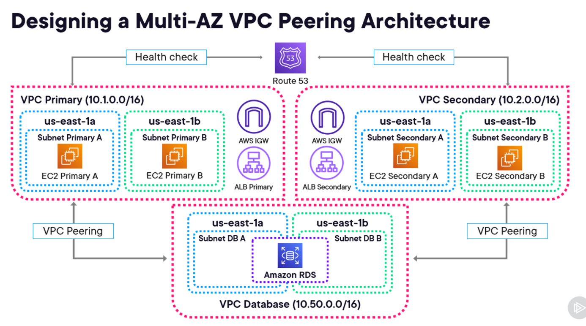
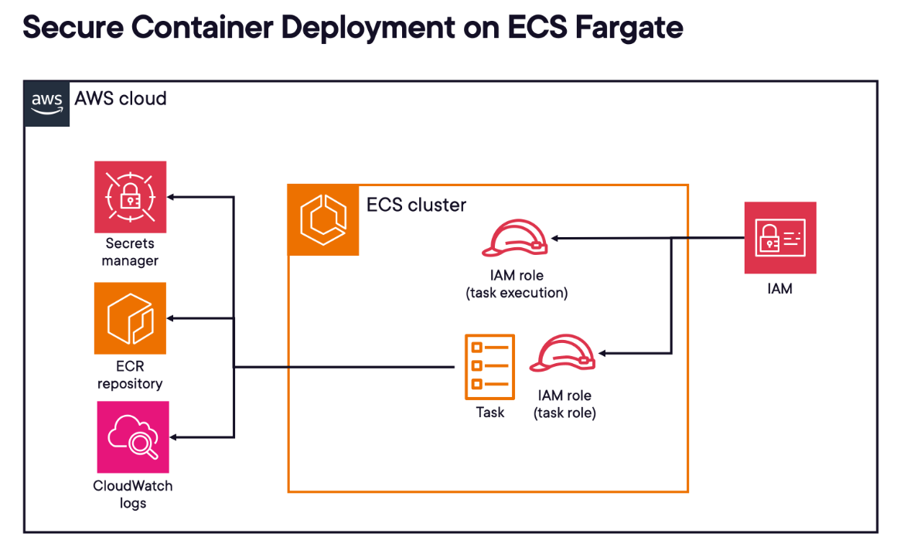

1. **VPC peering** is for private VPCs to talk to each other without traversing the public internet.
2. **aws direct connect** is private dedicated network to connect your onprem to aws.
3. meta-data/ to access ec2 instance metadata.
4. Resource policy - you attach to the resource being accessed.
5. If you want to minimize maintenance and patching, consider Serverless architecture and svcs.
6. When there is **Principal** in the policy, it is a resource-based policy.
7. 
8. 
9. almost always, cloudfront is used to front S3.
10. IGE is bidirectional, NAT gw is only outbound.
11. amazon redshift is for data warehousing, not ingestion.
12. site-to-site vpn uses the public internet, so not good for establishing connection between servers with a requirement that conn do not use/traverse public internet.
13. **Amazon S3 Glacier Deep Archive** is the lowest-cost storage class for long-term archival.
14. aws glue is not good for realtime ingesting.
15. S3 is not a file system.
16. you can assign multiple security groups to a resource.